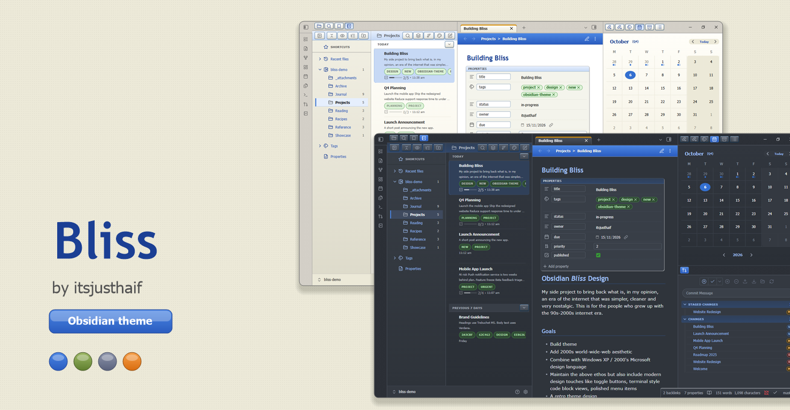
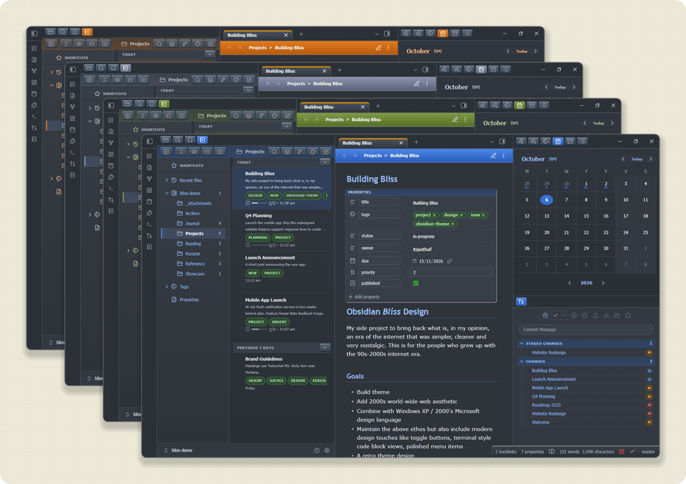
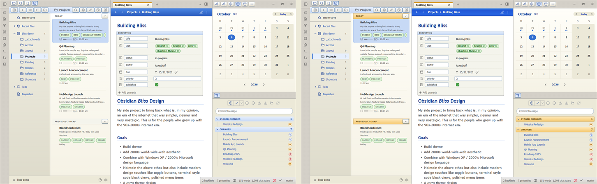
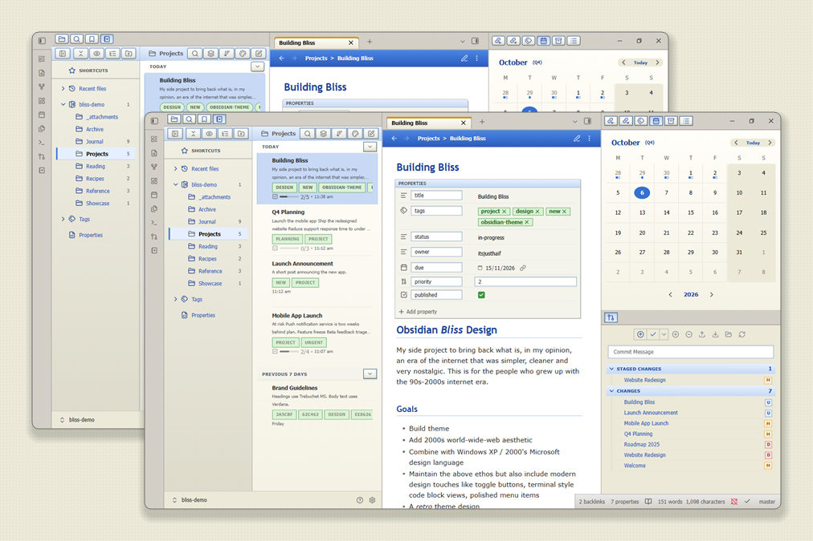

Obsidian, but it's 2001. Bevelled buttons, Luna blues and the gloriously boring look of the early web.

Bliss is a desktop theme for [Obsidian](https://obsidian.md/) that draws inspiration from the early web and classic Windows aesthetics. Glossy blues, soft greens, and a warm beige desktop create a familiar sense of nostalgia, while layouts echo the tidy structure of intranet portals and personal websites from the Y2K era. A slate dark mode is included for after-hours work. Bliss brings together retro charm and modern usability in a contemporary take on early 2000s design.

Inspired by: [Fernando Borretti on X](https://x.com/zetalyrae/status/2046805336137294294), [boringpunk-notes-app](https://github.com/eudoxia0/etudes/tree/cc2088d92ab9cb09890dd1d3488c0d5915304eab/html/boringpunk-notes-app)

## Contents

- [Contents](#contents)
- [Screenshots](#screenshots)
- [Installation](#installation)
- [Companion plugins](#companion-plugins)
- [Settings](#settings)
- [Plugin support](#plugin-support)
- [Customizing](#customizing)
- [Development](#development)
- [Changelog](#changelog)
- [\[1.2.0\]](#120)
  - [Added](#added)
  - [Changed](#changed)
  - [Fixed](#fixed)
- [License](#license)
- [Disclaimer](#disclaimer)

## Screenshots

Light and dark modes

XP accent presets: Luna Blue, Olive Green, Silver, Royale Energy Blue, Royale Noir, Zune, Embedded, plus two bonus Whistler pre-release schemes (Chartreuse Mongoose and Blue Lagoon, from the Mallard style)

Windows XP Nostalgia Mode, on and off

Classic square corners, on and off

Callouts, tables and classic sunken Luna frame code blocks with VS-style syntax colours

Extended Style Settings

## Installation
To install the theme

- Open Obsidian Settings
- Go to `Appearance` and click `Manage`
- Under community themes search for "Bliss" and click `Use`

To install manually, download and copy `theme.css` and `manifest.json` into `<vault>/.obsidian/themes/Bliss/`, then select Bliss under **Appearance**.

## Companion plugins

- [Style Settings](https://community.obsidian.md/plugins/obsidian-style-settings) unlocks every option listed below. [Recommended for all users of Bliss]
- [Notebook Navigator](https://community.obsidian.md/plugins/notebook-navigator) [Recommended]

## Settings

All options live in Style Settings under **Bliss**.

| Setting | What it does |
| --- | --- |
| Accent colour | Luna Blue, Olive Green, Silver, Royale Energy Blue, Royale Noir, Zune, Embedded, Whistler Chartreuse Mongoose, Whistler Blue Lagoon, or your Obsidian accent colour |
| Notes list background | Flat, warm paper or cream behind the Notebook Navigator list |
| Note background fade | Soft top-to-bottom tint behind the open note |
| Dark style | Dark mode only: Slate (the default), Midnight (deep blue-black with soft glow) or Contrast (near-black with brighter borders, text and focus rings) |
| Interface text size | 10 to 14 px for labels, buttons, sidebars and menus |
| Classic square corners | Square boxes, pills and buttons for the original intranet look |
| Disable desk texture | Removes the fine dot pattern from the window chrome and ribbon |
| Auto-hide status bar | Slides the bottom-right status bar out of view; hover the corner to reveal it |
| Toggle switches follow the accent | Off keeps the classic XP green for switched-on toggles |
| Windows XP Nostalgia Mode | Curved taskbar shading on pane headers, dialog title bars, primary buttons, sliders and accent toggles, plus sunset-orange strips on list date groups and Git sections. Off keeps the original look |

## Plugin support

Bliss styles these directly:

- [Notebook Navigator](https://github.com/johansan/notebook-navigator), including the calendar
- [Obsidian Git](https://github.com/Vinzent03/obsidian-git)
- [TaskNotes](https://github.com/callumalpass/tasknotes) and [Tasks](https://github.com/obsidian-tasks-group/obsidian-tasks)
- Canvas and Graph view, code blocks, properties panel, embedded backlinks and callouts (core Obsidian)

Most other plugins work, but are not themed specifically.

## Customizing

To preview every element Bliss styles, copy [docs/Bliss Theme Showcase.md](docs/Bliss%20Theme%20Showcase.md) into a vault.

Colours, gradients, radii and button states are CSS variables prefixed `--bp-` at the top of `theme.css`. Override them in a [CSS snippet](https://help.obsidian.md/Extending+Obsidian/CSS+snippets) to change the look without editing the theme.

## Development

Contributions are welcome. Fork the repo, branch from `dev` and open a pull request; only the owner merges and releases. See [CONTRIBUTING.md](CONTRIBUTING.md).

| Command | What it does |
| --- | --- |
| `npm test` | CSS lint, static performance audit and a check that finished features are still present (also runs in CI) |
| `npm run release-check` | Verifies manifest, changelog, tag and submission files agree (also runs in CI) |
| `npm run live` | Contrast, clipping and hit-target audit; needs Obsidian running with `--remote-debugging-port=9222` |
| `npm run parity` | Checks that dark mode has no light surfaces left; needs the same running Obsidian |
| `npm run perf:live` | Runtime performance comparison; needs the same running Obsidian |
| `npm run visual` | Screenshot comparison against local baselines (git-ignored); `npm run visual:update` resets them |
| `npm run selectors` | Checks the Obsidian classes the theme depends on against the installed Obsidian; `--write` refreshes [docs/internal-selectors.md](docs/internal-selectors.md) |
| `npm run task -- <name>` and `npm run ship` | Optional helpers for task branches and merging into `dev`; `npm run setup` enables the matching git hooks |

## Changelog
## [1.2.0]

### Added

- Style Settings: new Dark style option with Slate (the current look), Midnight (deep blue-black) and Contrast (near-black, brighter borders and text, clear focus rings). Midnight and Contrast add layered shadows to menus, dialogs and the active tab, and an accent glow on focused fields.
- Style Settings: new Auto-hide status bar toggle that slides the bottom-right status bar out of view and back on hover with a smooth glide (thanks to @rcegan, #1).

### Changed

- Dark mode: the desk texture dots are slightly more visible on Slate, blue-tinted on Midnight and fainter on Contrast.
- Dark mode: the note and list pane are now a lighter shade than the sidebars and window chrome, so the working surfaces feel raised. Properties, callouts, selected note card, hover and calendar colours, and muted text were retuned for the lighter surface.
- Cleaner stylesheet for the community theme checks: most `!important` rules replaced with higher selector specificity, and the unused `:has()` code block rule removed. No visual change intended.

### Fixed

- Dark mode: unresolved links are now readable, and calendar weekend cells use a subtle shade instead of a heavy block.
- Narrow windows: the sidebars now shrink and the note keeps a minimum width, so the right sidebar's tab icons no longer slide under the minimise, maximise and close buttons.
- Top row alignment: the left sidebar tab strip now uses the same height as the note tab bar and the ribbon, so the lines across the top line up.
- Notebook Navigator calendar year view: the current month is a filled accent cell again, so its white label is readable.

See [CHANGELOG.md](CHANGELOG.md) for complete release notes.

## License

Bliss is licensed under the MIT License. You may modify and redistribute it, but you must keep the copyright and license notice in your CSS file, including any code you extract as a standalone snippet.

## Disclaimer

This theme is provided as is and is designed for my personal use of Obsidian on Windows. As such it is not thoroughly tested across all operating systems, use cases and plugins.
This theme modifies significant parts of the Obsidian interface, so it may break with future updates. It may also be incompatible with other bits of custom CSS you have.

---

Made with ❤️ using [Claude](https://claude.ai).
