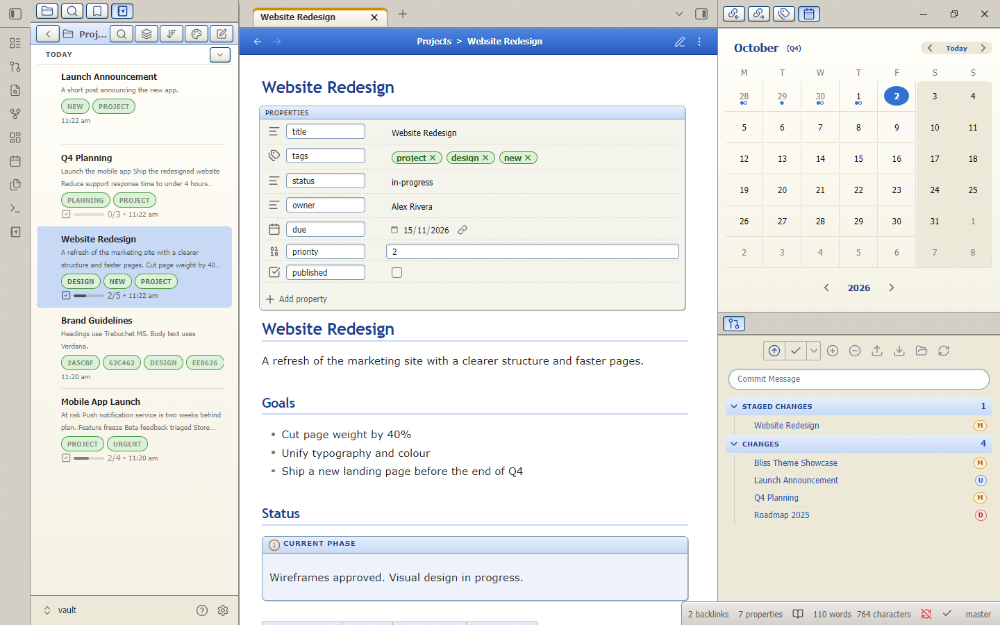
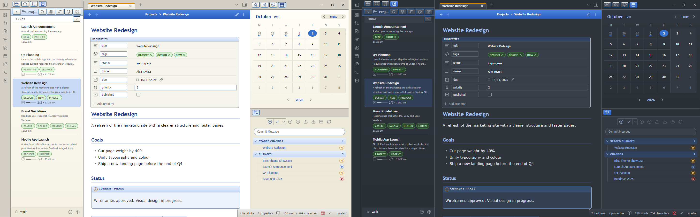
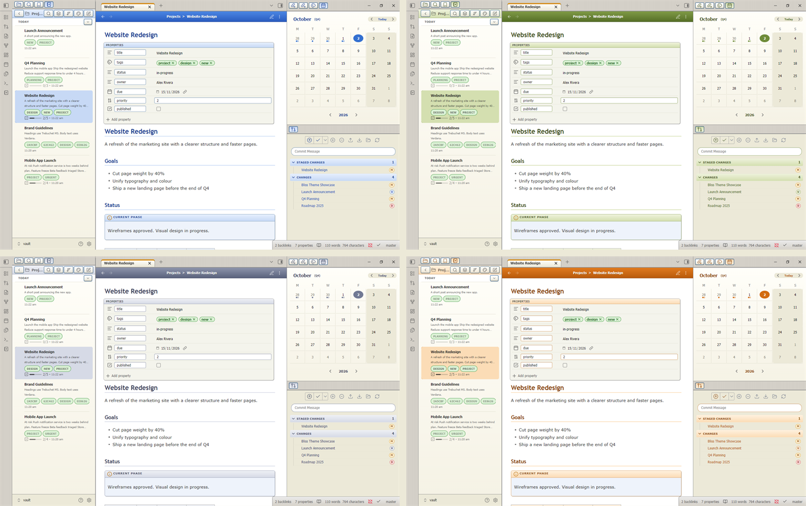
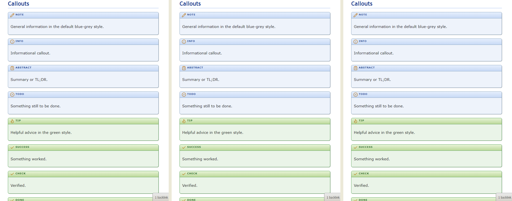
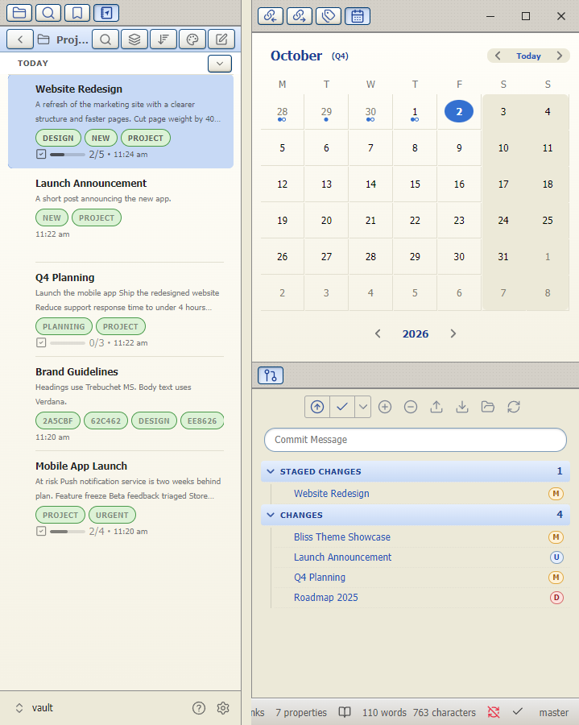
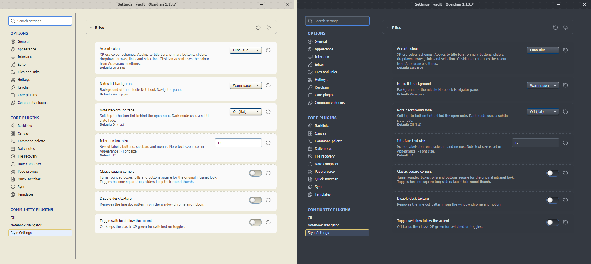

# Bliss

A Windows XP-inspired theme for [Obsidian](https://obsidian.md/) on desktop.

Remember when the web felt new? Bliss brings back the glossy blues and soft greens of Luna, bevelled buttons that look pressable, a warm beige desk and the tidy "enterprise portal" layout of early-2000s intranets. A slate dark mode is included for late nights.

## Contents

- [Screenshots](#screenshots)
- [Installation](#installation)
- [Companion plugins](#companion-plugins)
- [Settings](#settings)
- [Plugin support](#plugin-support)
- [Customizing](#customizing)
- [License](#license)
- [Disclaimer](#disclaimer)

## Screenshots

Light and dark modes

XP accent presets: Luna Blue, Olive Green, Silver and Orange

Callouts, code blocks and tables

Notebook Navigator, calendar and Obsidian Git

Glossy settings: toggles, dropdowns and inputs in light and dark

## Installation

To install the theme:

1. Open Obsidian Settings.
2. Go to **Appearance** and click **Manage** under Themes.
3. Search for "Bliss" and click **Use**.

To install manually, copy `theme.css` and `manifest.json` into `<vault>/.obsidian/themes/Bliss/`, then select Bliss under **Appearance**.

## Companion plugins

- [Style Settings](https://github.com/mgmeyers/obsidian-style-settings) unlocks every option listed below. Recommended for all users of Bliss.
- [Notebook Navigator](https://github.com/johansan/notebook-navigator) and [Obsidian Git](https://github.com/Vinzent03/obsidian-git) have dedicated styling. Both are optional.

## Settings

All options live in Style Settings under **Bliss**.

| Setting | What it does |
| --- | --- |
| Accent colour | Luna Blue, Olive Green, Silver, Orange, or your Obsidian accent colour |
| Notes list background | Flat, warm paper or cream behind the Notebook Navigator list |
| Note background fade | Soft top-to-bottom tint behind the open note |
| Interface text size | 10 to 14 px for labels, buttons, sidebars and menus |
| Classic square corners | Square boxes, pills and buttons for the original intranet look |
| Disable desk texture | Removes the fine dot pattern from the window chrome and ribbon |
| Toggle switches follow the accent | Off keeps the classic XP green for switched-on toggles |

## Plugin support

Bliss styles these directly:

- [Notebook Navigator](https://github.com/johansan/notebook-navigator), including the calendar
- [Obsidian Git](https://github.com/Vinzent03/obsidian-git)
- Properties panel, embedded backlinks and callouts (core Obsidian)

Most other plugins work, but are not themed specifically.

## Customizing

Colours, gradients, radii and button states are CSS variables prefixed `--bp-` at the top of `theme.css`. Override them in a [CSS snippet](https://help.obsidian.md/Extending+Obsidian/CSS+snippets) to change the look without editing the theme.

## License

Bliss is licensed under the MIT License. You may modify and redistribute it, but you must keep the copyright and license notice in your CSS file, including any code you extract as a standalone snippet.

## Disclaimer

This theme is provided as is. It modifies significant parts of the Obsidian interface, so it may break with future updates and may be incompatible with other custom CSS.
