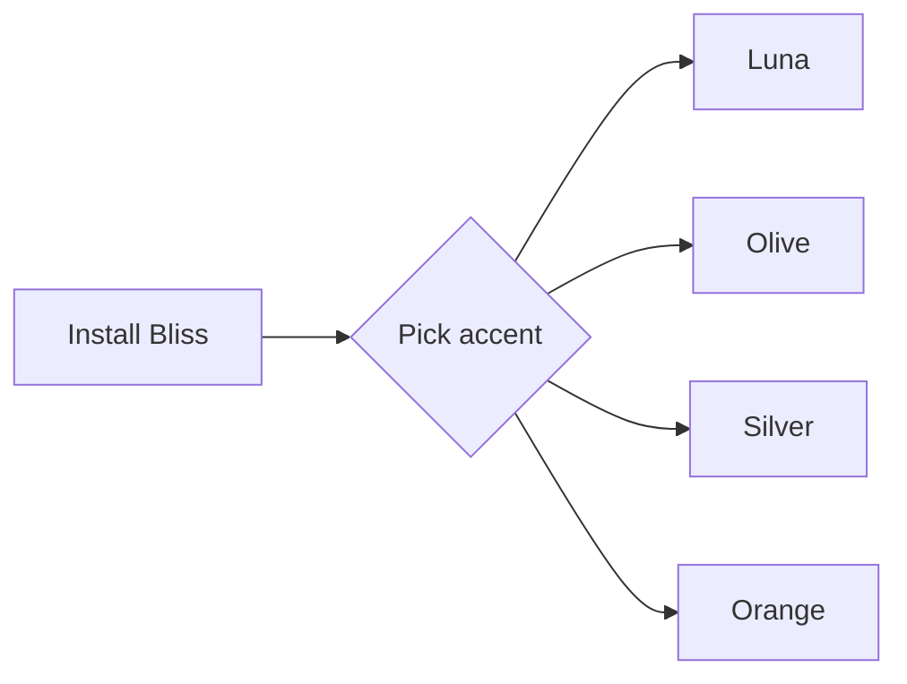

---
title: Bliss Theme Showcase
aliases:
  - Bliss Overview
tags:
  - bliss
  - showcase
  - new
  - archive
  - urgent
status: draft
version: 1.0.0
created: 2026-10-02
rating: 5
published: false
---

# Bliss

> A Windows XP-inspired theme for Obsidian. Glossy Luna blues, bevelled buttons, a warm beige desk and the tidy "enterprise portal" layout of early-2000s intranets.

**Bliss** brings back the golden age of the web: soft greens, orange hover glow, rounded chrome and dithered scrollbars, with a slate dark mode for late nights. Pick an XP accent, then fine-tune everything in Style Settings.

## At a glance

| Feature | Light | Dark | Notes |
| --- | :---: | :---: | --- |
| Luna Blue accent | Yes | Yes | Default |
| Olive Green accent | Yes | Yes | XP Olive scheme |
| Silver accent | Yes | Yes | XP Silver scheme |
| Orange accent | Yes | Yes | Warm variant |
| Obsidian accent | Yes | Yes | Follows Appearance colour |
| Classic square corners | Yes | Yes | Optional toggle |
| Desk texture | Yes | Yes | Optional toggle |
| Note background fade | Yes | Yes | Flat, warm, cream |

---

# Headings
## Heading level 2
### Heading level 3
#### Heading level 4
##### Heading level 5
###### Heading level 6

Body text in the reading font, with **bold**, *italic*, ***bold italic***, ~~strikethrough~~, ==highlighted text==, `inline code`, and a footnote reference.[^1]

Keyboard hint: <kbd>Ctrl</kbd> + <kbd>P</kbd> opens the command palette. Subscript H<sub>2</sub>O and superscript x<sup>2</sup>.

[^1]: Footnotes appear at the bottom of the note.

## Links

- Internal link: [[Bliss Theme Showcase]]
- Link with alias: [[Bliss Theme Showcase|Showcase note]]
- Heading link: [[Bliss Theme Showcase#Callouts]]
- Unresolved link: [[A note that does not exist yet]]
- External link: [Obsidian](https://obsidian.md)
- Bare URL: https://github.com/itsjusthaif/obsidian-bliss

## Lists

- Unordered item
  - Nested item
    - Deeply nested item
- Another item

1. Ordered item
2. Second item
   1. Nested ordered
   2. Nested ordered
3. Third item

## Tasks

- [ ] To do
- [x] Done
- [/] In progress
- [-] Cancelled
- [>] Forwarded
- [<] Scheduled
- [?] Question
- [!] Important
- [ ] Parent task
  - [x] Completed subtask
  - [ ] Open subtask

## Tags

#bliss #showcase #new #urgent #archive #theme/windows-xp #design/y2k

## Blockquotes

> Single-level quote with **formatting** and a [[Bliss Theme Showcase|link]].
>
> Second paragraph in the same quote.

> Outer quote
>> Nested quote
>>> Third level

## Horizontal rule

Above the line.

---

Below the line.

# Callouts

> [!note] Note
> General information in the default blue-grey style.

> [!info] Info
> Informational callout.

> [!abstract] Abstract
> Summary or TL;DR.

> [!todo] Todo
> Something still to be done.

> [!tip] Tip
> Helpful advice in the green style.

> [!success] Success
> Something worked.

> [!check] Check
> Verified.

> [!done] Done
> Completed.

> [!question] Question
> Something to answer.

> [!warning] Warning
> Proceed with care.

> [!caution] Caution
> Be careful here.

> [!attention] Attention
> Look at this.

> [!failure] Failure
> Something failed.

> [!danger] Danger
> Do not do this.

> [!bug] Bug
> A known defect.

> [!error] Error
> An error occurred.

> [!example] Example
> An example of the feature.

> [!quote] Quote
> "Remember when the web felt new?"

> [!tip]+ Collapsible, open by default
> Click the title to fold this callout.

> [!warning]- Collapsible, closed by default
> This content is hidden until expanded.

> [!note] Nested callouts
> Outer callout text.
> > [!tip] Inner callout
> > Callouts can be nested.

> [!info] Callout with rich content
> - A list item
> - Another item
>
> | Col A | Col B |
> | --- | --- |
> | 1 | 2 |
>
> ```js
> console.log("code inside a callout");
> ```

# Code

Inline code: `npm run build`, `--bp-accent-mid`, `body.theme-dark`.

```css
/* CSS: Bliss design tokens */
body {
  --bp-btn-radius: 4px;
  --bp-ring-hover: #fcc863;
}
.checkbox-container.is-enabled::after {
  transform: translateX(20px);
}
```

```javascript
// JavaScript
export async function greet(name = "world") {
  const message = `Hello, ${name}!`;
  console.log(message);
  return { ok: true, length: message.length };
}
```

```typescript
// TypeScript
interface Theme {
  name: string;
  version: `${number}.${number}.${number}`;
  accents: Array<"luna" | "olive" | "silver" | "orange">;
}
const bliss: Theme = { name: "Bliss", version: "1.0.0", accents: ["luna"] };
```

```python
# Python
from dataclasses import dataclass

@dataclass
class Accent:
    name: str
    hex: str

accents = [Accent("Luna", "#3470d0"), Accent("Olive", "#81a04a")]
for a in accents:
    print(f"{a.name}: {a.hex}")
```

```powershell
# PowerShell
Get-ChildItem -Recurse -Filter *.md | Where-Object { $_.Length -gt 1KB } | Select-Object Name, Length
```

```json
{
  "name": "Bliss",
  "version": "1.0.0",
  "minAppVersion": "1.4.0",
  "author": "Mohammed Haif"
}
```

```yaml
# YAML
name: Bliss
accents:
  - luna
  - olive
enabled: true
```

```html
<!-- HTML -->
<button class="mod-cta" disabled>Save</button>
```

```bash
# Bash
git commit -m "Add showcase" && git tag v1.0.0
```

```sql
SELECT name, version FROM themes WHERE author = 'itsjusthaif' ORDER BY version DESC;
```

```diff
- old line
+ new line
```

```
Plain code block with no language
    indented line
```

A long line to show horizontal scrolling inside a code block:

```text
This is a very long line of text that should overflow the width of the code block and trigger the horizontal scrollbar so the theme's scrollbar styling can be captured in a screenshot.
```

# Tables

| Name | Type | Default | Description |
| --- | --- | --- | --- |
| Accent colour | Class select | Luna Blue | XP-era colour schemes |
| Notes list background | Class select | Warm paper | Notebook Navigator list tint |
| Note background fade | Class select | Off | Soft top-to-bottom tint |
| Interface text size | Number | 12px | 10 to 14 px |
| Classic square corners | Toggle | Off | Original intranet look |
| Disable desk texture | Toggle | Off | Removes dot pattern |
| Toggles follow accent | Toggle | Off | Off keeps XP green |

| Left | Centre | Right |
| :--- | :---: | ---: |
| a | b | c |
| longer text | centred | 1,234.56 |

# Embeds

![[Bliss Theme Showcase#Headings]]

# Math and diagrams

Inline math: $E = mc^2$

$$
\int_0^\infty e^{-x^2}\,dx = \frac{\sqrt{\pi}}{2}
$$



# Comments and misc

%% This is a comment and is hidden in reading view. %%

Text with a line break  
on the next line.

Emoji: ✅ ⚠️ 🔥

---
